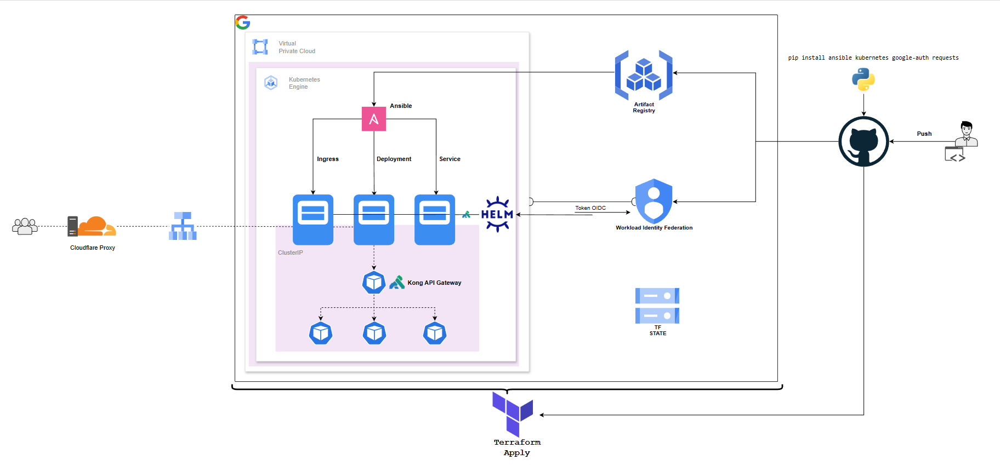

# Provisionamento de Plataforma CI/CD
# *Silas Santos*


*(Fluxo da esteira de automação e arquitetura da aplicação)*


## Abordagem

O objetivo foi construir uma Esteira de Entrega de Software robusta, eliminando intervenções manuais na infraestrutura.

Utilizei uma orquestração híbrida: Terraform para a infraestrutura e Ansible para a configuração dinâmica, tudo rodando sobre um cluster GKE. O foco é automatizar de ponta a ponta: do commit até o deploy.

A solução cobre:
- Provisionamento de infraestrutura com Terraform
- Configuração dinâmica com Ansible
- Autenticação segura via Workload Identity Federation
- Deploy contínuo em Kubernetes (GKE)
- Exposição da aplicação via Kong Gateway

## Arquitetura

### 1. Segurança e Identidade (WIF)
* Implementei o Workload Identity Federation.
* Configurei uma relação de confiança onde o Google troca tokens temporários com o GitHub Actions baseando-se na assinatura OIDC do repositório.
* Isso mitiga o risco de vazamento de credenciais de Service Accounts.

### 2. Terraform
*  O estado da infraestrutura é armazenado em um bucket Google Cloud Storage.
*  Bootstrapping: O próprio código é capaz de provisionar o bucket de backend, garantindo que toda a infraestrutura seja reprodutível sem dependências manuais prévias.

### 3. Rede e Acesso
*  Não abri as portas 80/443 via Terraform. Deixei que o Kubernetes solicitasse essa abertura dinamicamente ao LoadBalancer apenas quando necessário.
*  Configurei o acesso aos nós via IAP (Identity Aware Proxy), permitindo tunelamento seguro gerenciado pela GCP sem expor os servidores.

### 4. Ansible

* Instalei dependências Python no Runner para permitir que o Ansible conversasse nativamente com a API do GKE.
* Usei templates Jinja2 para injetar a imagem Docker correta nos manifestos Kubernetes em tempo de execução.

---

### Secrets

 
Os únicos segredos utilizados na esteira estão armazenados no GitHub Actions Secrets.

Não há credenciais sensíveis versionadas no repositório.
A autenticação com a Google Cloud é realizada via
Workload Identity Federation, eliminando o uso de
Service Account Keys.

### Passo a Passo

1. **Execução do Pipeline:**  
   O processo é 100% automatizado via GitOps.

   ```bash
   git add .
   git commit -m "feat: deploy infra and app"
   git push origin main 
    > O Terraform valida o estado e provisiona a VPC e o Cluster GKE.

    > O Docker faz o build da imagem e push para o Artifact Registry.

    > O Ansible instala o Kong (aplicando correção de IPv6) e faz o deploy da aplicação atualizada.

2.  **Finalizando:**
    Acesse o IP entregue pelo Load Balancer e configure o apontamento DNS no Cloudflare (Proxy Mode) para garantir o SSL gerenciado na borda.

---

**Autor:** Silas Santos de Souza | Analista de Sistemas
https://www.linkedin.com/in/silas-santos-in-cloud | https://github.com/SilasMesmo